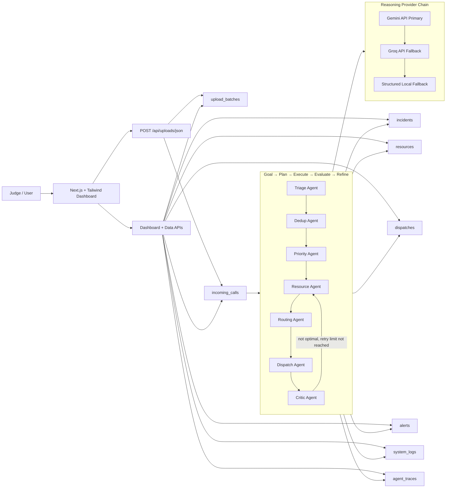
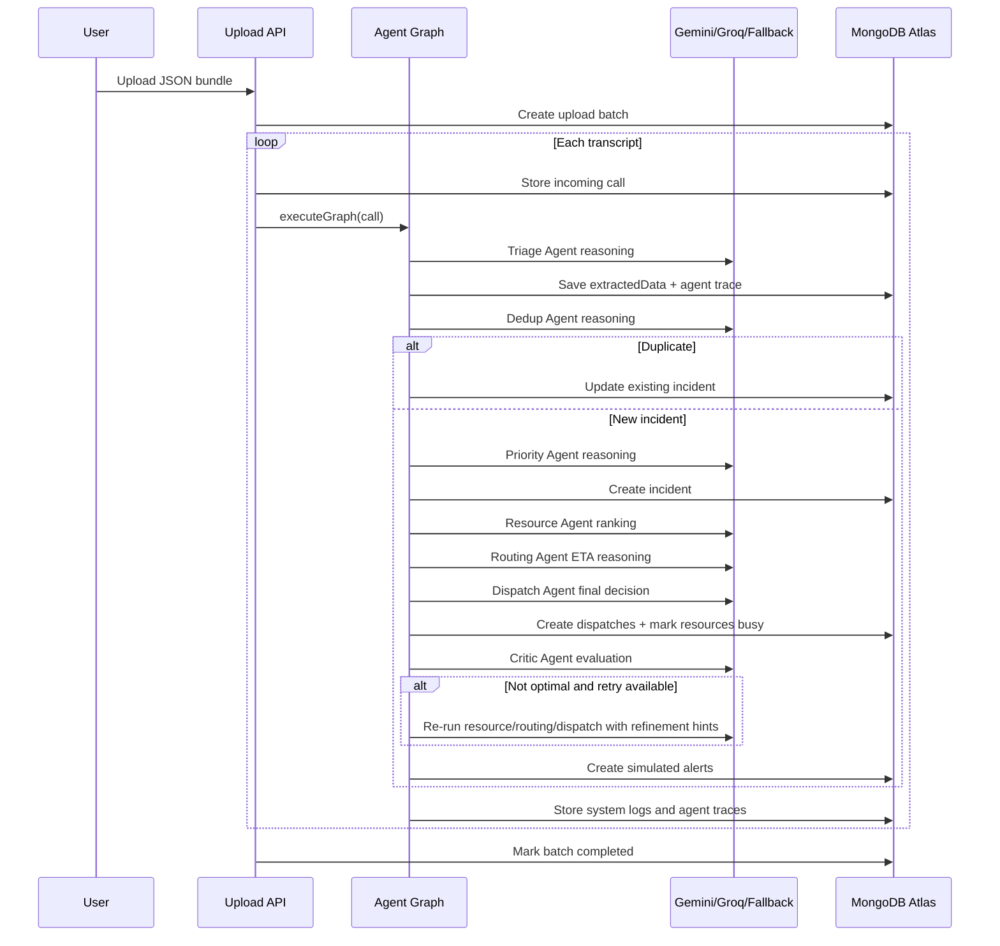

# CrisisWeave System Architecture

## High-Level Architecture

## Agent Graph Sequence

## Reasoning Priority

Every agent follows the same provider strategy:

1. Gemini API, using `GEMINI_API_KEY`.
2. Groq API, using `GROQ_API_KEY`.
3. Local structured fallback logic already present in the project.

This keeps the demo intelligent when keys are present and stable when network/API access is unavailable.
