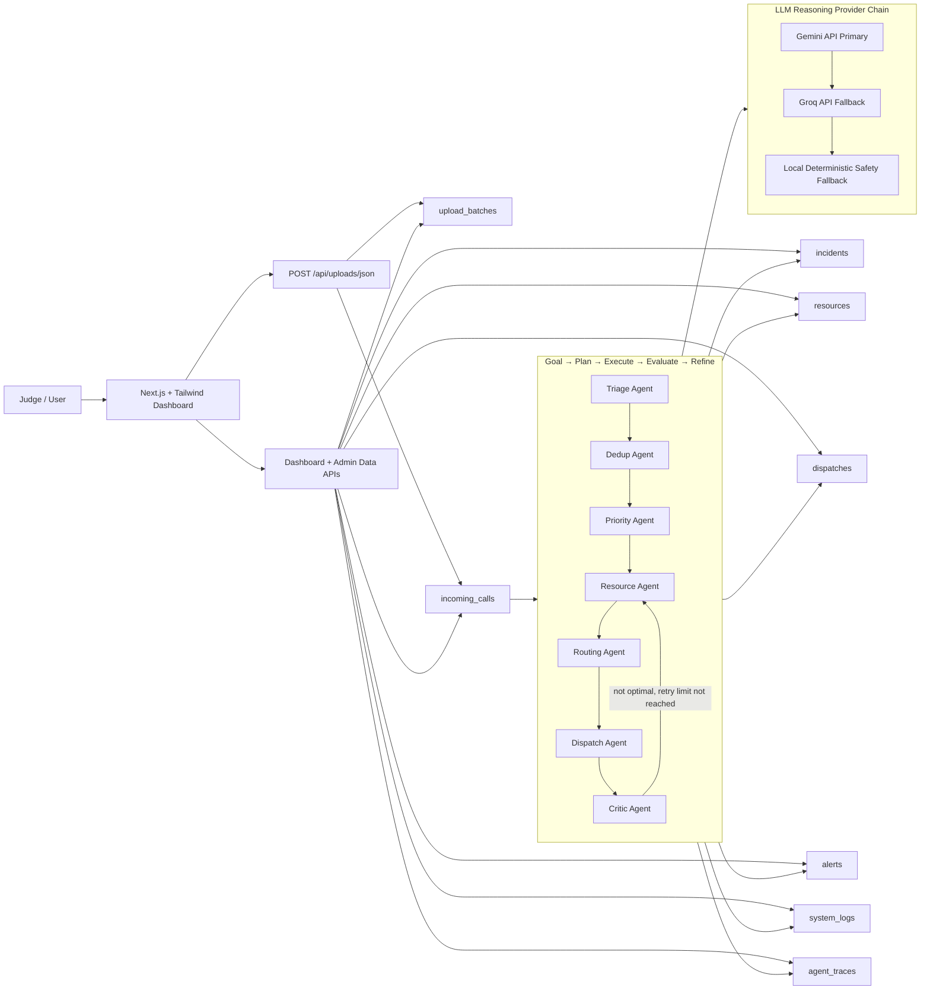
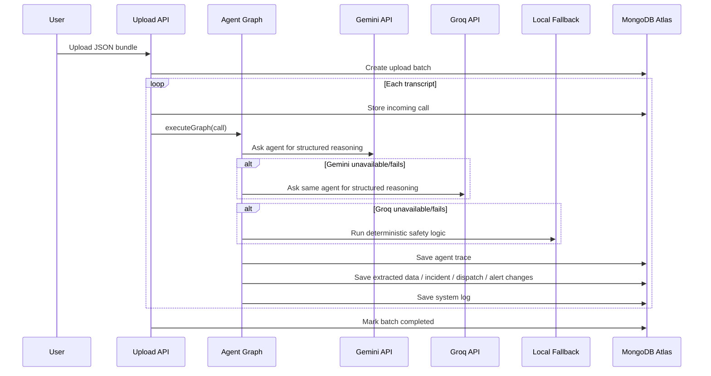
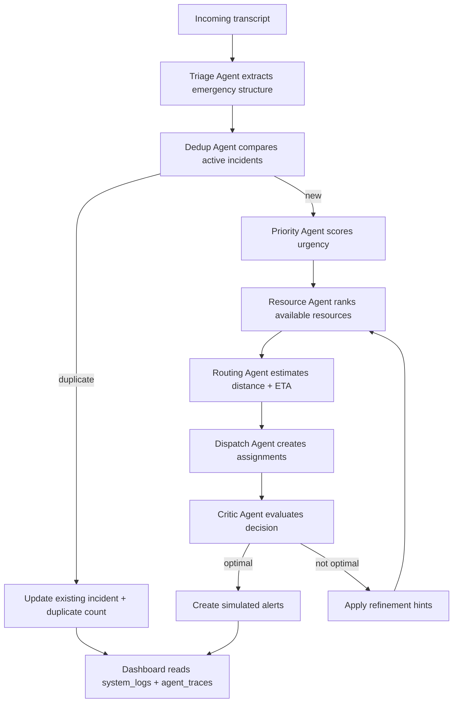

# CrisisWeave System Architecture

## High-Level Architecture

## Agent Graph Sequence

## Decision Flow

## Reasoning Priority

Every agent follows the same provider strategy:

1. Gemini API using `GEMINI_API_KEY`.
2. Groq API using `GROQ_API_KEY`.
3. Local deterministic fallback logic only if providers fail.

The project is intended to demonstrate API-key powered agentic reasoning while staying robust during demos.
